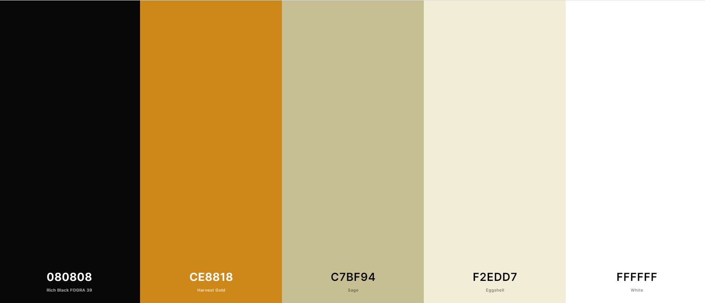
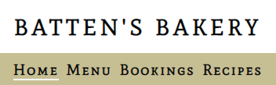
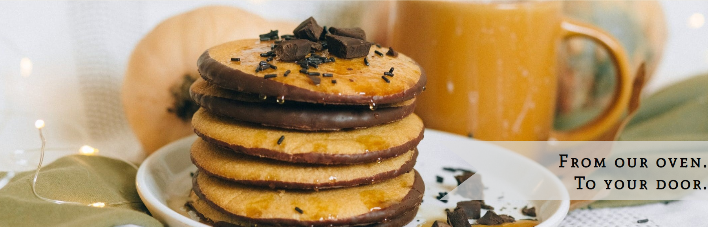
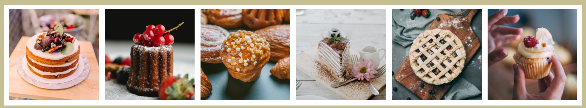
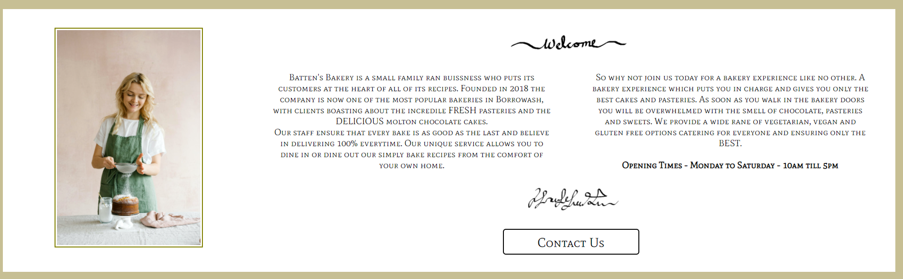
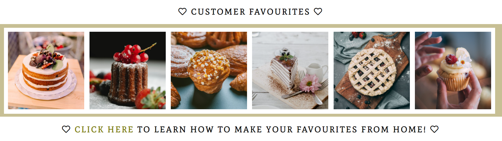
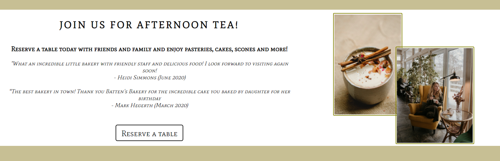
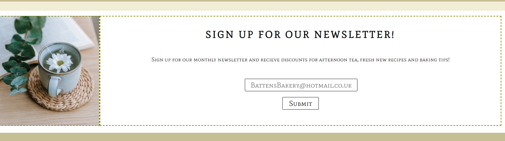
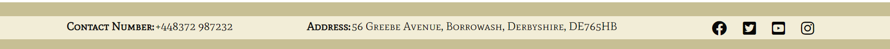

erv# Batten's Bakery

[Live Link]()

[GitHub Repository]()

# Overview

[Batten's Bakery]() is a Bakery Website aimed at enticing customers to book in for its famous afternoon tea. It promotes delicious cakes and scrumptious pasteries with an added lockdown twist at the companies request to allow its customers to bake their favourites whilst in the comfort of their own home. Batten's Bakery caters for many dietery requirements including vegatarian, vegan and gluten free options in all its recipes.

The site itself is fully responsive and deisgned in a simplistic and easy to navigate manner. It has been coded using solely HTML and CSS due to this being my first project and therefore although it has 'form' elements on the website, due to no back-end fuctionality the entered fields will not be sent anywhere.

# UX 

## User Stories

### First Time Visitor Goals:
 - As a First Time Visitor, I should clearly understand the main purpose of the site and be wanting to know more about what Batten's Bakery has to offer.
 - As a First Time Visitor, I should be able to navigate easily around the site to find important information.
 - As a First Time Visitor, I should be able to easily access contact details and socail media platforms for more infromation on what Batten's Bakery has to offer.

### Returning Visitor Goals:
- As a Returning Visitor, I should be able to easily navigate to the bookings page to reserve a table for afternoon tea.
- As a Returning Visitor, I should be notified of any new recipes after signing up for the exclusive newsletter.
- As a Returning Visitor, I you should be able easily contact Batten's Bakery for any baking queries.

### Frequent User Goals:
- As a Frequent User, I want to be able to download the afternoon tea menu to save time finding the page in the future.
- As a Frequent User, I want to be able to check if there are any new recipes and be notified of this through the newsletter.
- As a Frequent User, I want to be able to challenge my baking skils and try more recipes catering for large groups.

# Design

## Colour Scheme

- The sites primary colours are green, cream, black and white. The image above displays the original colour scheme which was chosen for the website. It uses a wide range of pastel shades to create a soft texture to the website; whilst also ensuring that text is clear and readable. 

- The websites main text was written against a white background this was due to the contrast against the green making it stand out to the user on the page. 

- The colour pallete was chosen and matched using [coolors.co](https://coolors.co/).

## Typography 

- The main font used throughout the whole wesbite was 'Mate SC' with Sans Serif as a fall back font in the rare instance that the font is incorrectly imported onto the site. Alongside this font some hand written text was written to create a more personalised feel to the website whilst also contrasting nicely against the hard edges of 'Mate SC'. Both of these text styles are easy to read and suited the style of the website.

## Imagery

- The images on the website were carefuly and deliberately choosen to blend with the colour scheme of the website. The intial large heading image captures the users attention whilst also working in unison with the website. Images on the recipes pages were chosen to entice the user and therefore look delicious!

## Navigation Bar

- The navigation bar consistently appears on all of the pages and contains links to the home, menu, bookings and recipes pages which alows for easy navigation around the website. When the user hovers over the navigation section a solid white line appears under the text and remains there on the 'active' webpage. This simplistic addition suits the elegance of the website as opposed to a solid background colour.

# Wireframes

To ensure efficiency in my coding of the website I created wireframes for each page to give an outline of what each page should look like and the layout of text and images. The links to these can be found below both for desktop and mobile devices.

## Desktop Wireframes

[Index-Page](assets/images/main_web_template.PNG)

[Menu-Page](assets/images/menu_web_template.PNG)

[Bookings-Page](assets/images/bookings_web_template.PNG)

[Recipes-Page](assets/images/recipes_web_template.PNG)

[Recipe-Steps-Pages](assets/images/recipessteps_web_template.PNG)

## Mobile Wireframes
 
[Index-Page](assets/images/main_phone_template.PNG)

[Menu-Page](assets/images/menu_phone_template.PNG)

[Bookings-Page](assets/images/bookings_phone_template.PNG)

[Recipes-Page](assets/images/recipes_phone_template.PNG)

[Recipe-Steps-Pages](assets/images/recipessteps_phone_template.PNG)

Some alterations were made from the original wireframe designs to improve User Experience (UX). These include:

- Padding colours were used in between each section of the website to create consistency between each section.
- The menu section was split into 3 parts ensuring users were not overwhelmed with solid text.
- Above the 'Our Cakes' section a heading was added giving users understanding of what the section was about and a link created below.

# About Us Section

## Welcome

- The Welcome Section of the site introduces users to Batten's Bakery and gives a personalised feel to the website containing a hand written welcome message and signature. 
- Users are given the option to contact us for more information. The button jumps to the footer of the page containing contact numbers and social media links

# Customer Favourites Section

## Cake Strip

- The Customer Favourites Section is eye catching to the user and contains a strip of delicious cakes that are individually linked to the step by step recipe guide.
- Users should be drawn to this section of the website due to the vibrant use of colour against a nuetral background. This should encourage then to either want to try the cakes fresh from the bakery or bake their own at home.

# Join Us Section

## Afternoon Tea

- The Join Us Section aims to entice the reader to book in for afternoon tea at Batten's Bakery. It contains information about what there is to offer along with testomonials from customers.
- Users are then given the option to reserve a table using a linked button to the booking page.
- Images have been carefully selected to blend with the colours of the website whilst also being relevant to the section and encouraging the user to book. 

# Newsletter Section

## Sign Up

- The Newsletter Section allows the user to sign up to Batten's Bakery giving then new recipes and discounts to afternoon tea straight to their imbox. This section is responsible for enticing the user to revisit the site in the future hence why it features on all of the main pages on the website.

# Footer Section

## Social Media Platforms

- The Footer Section includes links to the relevant social media platforms. These links open in a new tab which allows easy navigation for the user and prevents then leaving the site.
- This is a valuable section of the website as it allows the user to view more testomonials and information about the bakery.

# Menu Section

- The Menu Section of the website allows the user to view and download Batten's Bakery website allowing them to choose food and check dietery requirements before visiting. 
- Users should be well informed as a result of this page and as a result want to book for afternoon tea.

# Bookings Section

# Recipes Section

- The Bookings Section includes a form which is editable to the user. It is simple to fill out and allows the user to select a time, date and specify the number of people attending (limited to 6 people).
- This section is easy to navigate making users more likely to reserve a table.

- The Recipes Section conatins 6 baking ideas for users to try at home. This section was made upon request of the client who wanted customers to have the option to bake from home whilst in lockdown. It aims at promoting the companys bakes by getting users to share thier bakes on social media with the hashtag #battensbakes.
- Each recipe contains a star rating, time frame and dietery requirements ensuring the customers needs are met on each page.

# Baking Steps Sections

- The Baking Steps Sections contain different recipes chosen from the recipes page broke down into ingredients and method sections.
- Steps have been ordered to ensure users do them sequentially.
- At the bottom of each recipe users are encouraged to share their bakes on social media to promote Batten's Bakery further.